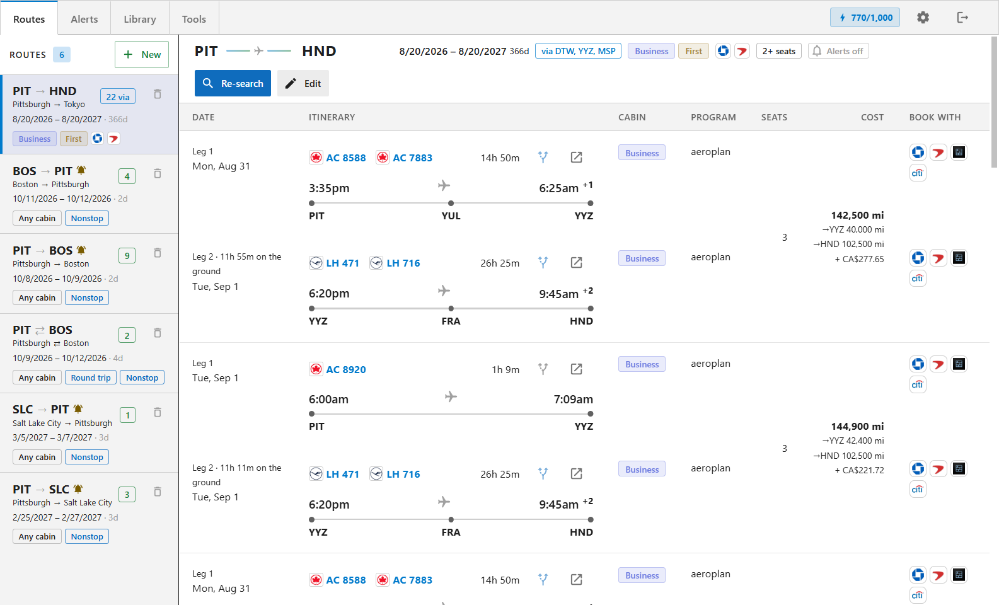
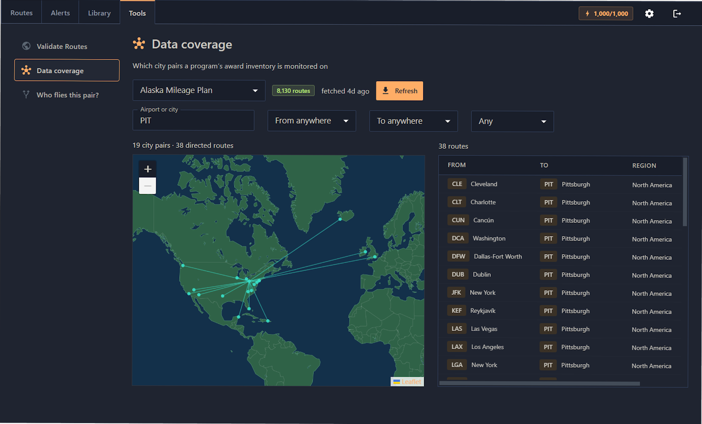
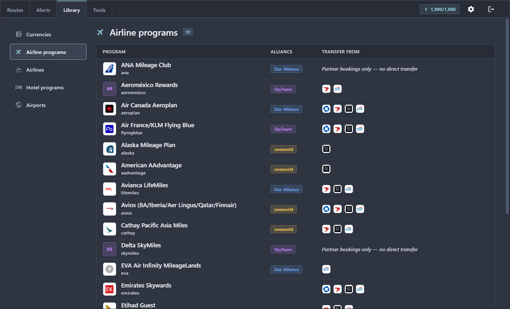

# BertBooker

A self-hosted award-travel availability tracker to use with your seats.aero API key, or your own data provider. Run it locally or deploy to a free Cloudflare account.

* Search trips with award deals, one way or round trip.
* Find routes built from separate tickets from separate award providers.
* Set automated monitoring and alerting.

<table>
<tr>
<td width="33.3%"></td>
<td width="33.3%"></td>
<td width="33.3%"></td>
</tr>
</table>

## What you need

| | |
|---|---|
| **seats.aero Partner API key** | **Paid**. See [seats.aero/apidocs](https://seats.aero/apidocs) and [`docs/SEATS-AERO.md`](docs/SEATS-AERO.md). |
| **Cloudflare account** *(optional)* | Free tier is enough: Workers, D1 and Cron Triggers all fit inside it. The `wrangler` dev dependency does NOT require a cloudflare account, so you can run locally without one. |
| **Resend account** *(optional)* | Only for the alert digest, and only with a domain you have verified for SPF/DKIM. Without it, sweeps still run and still ingest; each digest is just recorded as `skipped`. |

## Documentation

- [`docs/SOURCES.md`](docs/SOURCES.md) — how additional data sources can be added
- [`docs/SEATS-AERO.md`](docs/SEATS-AERO.md) — How the paid seats.aero API is implemented as a data source. Bring your own API key.
- [`docs/ALERTS.md`](docs/ALERTS.md) — how BertBooker periodically searches tracked routes and sends configurable email alerts
- [`docs/UI-TESTING.md`](docs/UI-TESTING.md) — driving the SPA headless for testing and debugging.

## First-time setup

```sh
git clone https://github.com/robgwalsh/bertbooker.git
cd bertbooker
npm install

# 1. Create the D1 database. Wrangler prints an id — paste it into
#    api/wrangler.toml as `database_id`, REPLACING the one already
#    there (that one is the author's and means nothing on your account).
#    Nothing that touches the database works until you do; wrangler will tell
#    you the database does not exist rather than failing quietly.
npx wrangler d1 create bertbooker_db

# 2. Configure the worker. Every value is documented inline in the template.
cp api/.dev.vars.example api/.dev.vars

#    SESSION_SECRET wants 32 random bytes:
node -e "console.log(Buffer.from(crypto.getRandomValues(new Uint8Array(32))).toString('base64url'))"

# 3. Apply schema + seed programs to the LOCAL dev database.
npm run db:apply:local
npm run db:seed:local

# 4. Optional: airport reference data (~72k rows) for the Airports tab, the
#    origin/destination autocompletes and the trip list's route maps.
npm run build:airports
npm run db:seed:airports:local
```

`api/.dev.vars` is gitignored and is the only environment file.

## Run locally

```sh
npm run dev:api        # API worker → http://127.0.0.1:8787
npm run dev:app        # SPA        → http://localhost:5173
# Or
npm run dev            # Runs both
```

Open <http://localhost:5173> and sign in with the `APP_PASSWORD` you set.

Note `wrangler dev` does **not** reload `.dev.vars` — edit a value and the old
one keeps working until you restart the API.

### Local-dev notes

- Wrangler binds IPv4, so use `127.0.0.1:8787` (`localhost` can resolve to IPv6 `::1` and hang). Vite binds IPv6, so use `localhost:5173` (`127.0.0.1` is refused).
- The local D1 lives under `--persist-to .wrangler-local` at the repo root. Every
  script that touches it — `dev:api` and the `db:*` ones — runs wrangler from the
  root with `--config api/wrangler.toml`; don't change one without the
  others.
- **If the API seems to "hang"** — spinners in the SPA, nothing in the network tab
  or console — the port is wedged, not the code. Ctrl+C doesn't kill
  `wrangler dev` cleanly on Windows: the `workerd` grandchildren survive holding
  :8787, and the next wrangler binds it *alongside* them, so requests are accepted
  and never answered. `npm run dev:api` clears that automatically before starting
  (`predev:api` → `scripts/free-port.mjs`); `npm run dev:api:stop` tears a server
  down by hand.

## Test & typecheck

```sh
npm test         # one vitest run over shared/, api/, app/ — offline and hermetic
npm run typecheck
npm run test:ui  # the browser suite, headless — see docs/UI-TESTING.md
```

## Deploy To Cloudflare

Nothing is configured in the repo — set every value on your own account. The
first three are required; the rest match the sections in
`api/.dev.vars.example`.

```sh
cfg="--config api/wrangler.toml"

npx wrangler secret put APP_PASSWORD        $cfg   # required
npx wrangler secret put SESSION_SECRET      $cfg   # required
npx wrangler secret put APP_USER_EMAIL      $cfg   # required — the cron fails closed without it
npx wrangler secret put SEATS_AERO_API_KEY  $cfg   # required to search

npx wrangler secret put RESEND_API_KEY      $cfg   # only for alert emails
npx wrangler secret put ALERT_FROM          $cfg   #   "
npx wrangler secret put APP_URL             $cfg   #   " — base URL for the digest's link

# Apply the schema to the REMOTE database, once:
npm run db:apply:remote
npm run db:seed:remote

npm run deploy    # vite build → wrangler deploy. The build is not optional:
                  # wrangler uploads app/dist as-is, so skipping it ships a
                  # stale bundle without failing.
```

`APP_USER_EMAIL`, `ALERT_FROM` and `APP_URL` are not sensitive — they are set as
secrets only so that no personal value lives in a public repo. If you would
rather keep them in `wrangler.toml` on your own fork, a `[vars]` block works and
secrets override vars of the same name.

## Third-party data and services

- **seats.aero** — a paid Partner API, used as documented. Not affiliated with
  this project. See [`docs/SEATS-AERO.md`](docs/SEATS-AERO.md).
- **Airport data** — [OurAirports](https://ourairports.com/data/), public domain.
  Regenerate with `npm run build:airports`.
- **Map geometry** — [Natural Earth](https://www.naturalearthdata.com/), public
  domain, via
  [martynafford/natural-earth-geojson](https://github.com/martynafford/natural-earth-geojson).
  Regenerate with `npm run build:world`.
- **Airline and program names** are trademarks of their respective owners, used
  here only to identify the programs a seat can be booked with.

This project does not scrape airline websites.

## License

[MIT](LICENSE) — © 2026 Rob Walsh.

Provided as-is, with no warranty. You are responsible for your own use of the
third-party services above, including their terms, their rate limits, and any
costs you incur.
